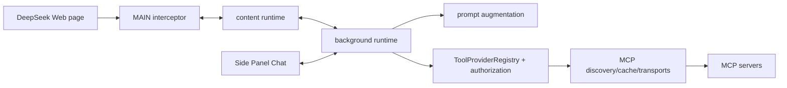

# MCP Capability Plane — Project Overview

## Implemented Direction

DeepSeek++ 的 MCP 已从“每轮注入全部工具 Schema”升级为受预算控制的 Capability Plane：常用工具可直接暴露，长尾工具通过后台签发的 capability handle 按需检索、说明和调用，且不削弱真实工具的授权、审计或执行边界。

## Confirmed Task Definition

范围限定为桌面 Chrome、Edge、Firefox 上的 MCP 工具提示词投影、能力句柄、统一授权执行、Side Panel/automation/inline-agent 接入和 MCP 设置入口。实现不内置第三方 dynamic-mcp 服务，也不新增移动端路径。

## Current Architecture

MCP cache 持有完整 `ToolDescriptor`，执行前会重新发现服务并通过 descriptor security snapshot 验证。`ToolProviderRegistry` 是 provider 聚合与 provider-first 路由的唯一入口；`core/tool/authorization.ts` 持有 receiver-owned grant、descriptor snapshot 与一次性 call reservation。本次实现把四个聊天/执行面的 prompt selection 收拢为同一 projection service：完整 descriptors 只留在扩展侧，模型仅看到 direct projection 或受限的 discover/describe/invoke helpers。

## Technology Stack

| Layer | Current | Implemented change |
|:--|:--|:--|
| Language | TypeScript / ESM | 保持 |
| Extension | WXT MV3 | 保持 PC 浏览器范围 |
| UI | React 19 / Side Panel | 每服务器 visible/adaptive/on-demand 和 adaptive prompt budget 控件 |
| Persistence | `chrome.storage.local` / IndexedDB | 独立、严格版本化 capability settings 与 session-scoped lease state |
| Tool runtime | `ToolDescriptor`、authorization、provider registry | 单一真实 target resolver，支持 direct 与 opaque handle 两种投影 |
| MCP | HTTP/SSE/Streamable HTTP/bridge/native | 不改 transport 语义；Catalog 建立在已发现 descriptors 上 |

## Entry Points

| Entry | Relevant responsibility |
|:--|:--|
| `entrypoints/content.ts` | 手动聊天 prompt authorization、工具执行、inline agent 发起 |
| `entrypoints/background.ts` | runtime composition、Side Panel prompt、automation prompt/execute |
| `entrypoints/background/tool-provider-composition.ts` | 真实 MCP 与 local tool providers 的组合根 |
| `entrypoints/background/tool-execution-handlers.ts` | content/background authorization bridge |
| `entrypoints/background/chat-runtime-service.ts` | Side Panel/Web/API 工具 continuation loop |
| `core/mcp/*` | server config、discovery、cache、真实 MCP execution |
| `core/tool/*` | descriptor、provider registry、authorization、runtime/history |
| `core/prompt/augmentation.ts` | 工具 Schema 的模型可见渲染 |

## Build & Run

| Purpose | Command |
|:--|:--|
| Targeted tests | `npx vitest run <files>` with 60-second process timeout |
| TypeScript | `npm run compile` |
| Prompt contract | `npm run prompt:freeze` |
| MCP smoke | `npm run smoke:mcp` and `npm run verify:mcp:mock` |
| Cross-browser build | `npm run build:all` |
| Closure | `npm run ci:quality` |

## Testing Baseline

新增的 projection、lease 和 runtime suites覆盖自适应排序/预算、句柄签发与一次性消费、target identity 拒绝和四个运行时表面；同时保留 MCP execution policy、持久化、授权、provider routing、runtime handler、request augmentation、Side Panel、inline-agent 与 automation 回归面。最终 `npm run ci:quality` 全绿。

## Project Governance Baseline

| Surface | Resolution |
|:--|:--|
| Shared instructions | Root `AGENTS.md` is sole truth |
| Root `CLAUDE.md` | Forbidden; absent |
| Native memory | Available outside repository |
| Repo-local memory | Forbidden |
| Previous active docs | Archived to `docs/archives/pc-runtime-hardening-wave-2/` before this run |
| Tracking | `LOCAL_ONLY`; GitHub pre-flight found `GITHUB_STANDARD`, but no new public planning Issues are created without separate authorization |

## External Integrations

- MCP servers via HTTP, SSE, Streamable HTTP, bridge and native messaging;
- DeepSeek page and official API chat continuations;
- browser runtime messages between content, background and Side Panel.
