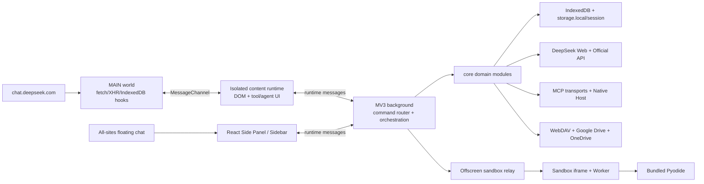

# DeepSeek++ Project Overview

## Preliminary Direction

在保留现有用户数据、功能表面和跨版本契约的前提下，对 DeepSeek++ 做结构性重构，系统提升浏览器插件的性能、稳定性、兼容性、可维护性与向后兼容性。具体范围和优先级将在 Phase 2 基于本分析确认。

## Confirmed Task Definition

用户于 2026-07-13 确认本轮任务名为 **DeepSeek++ Reliability and Compatibility Refactor**，并确定以下执行边界：

1. **Scope**：主范围包含 PC 端 Chrome/Edge/Firefox 扩展、Shell Native Host、同步、持久化和自动化；Android、移动 WebView 和移动安装包不再属于产品范围。
2. **Strategy**：采用 compatibility-contract-first 的渐进式重构。先固定历史数据和行为合同，再修安全/数据/取消语义，之后建立有真实消费者的 ports、拆分大型入口，最后依据测量结果优化性能。
3. **Compatibility**：保留全部现有用户功能、prompt 输出、storage keys、IndexedDB、sync/MCP/runtime message/Native Host 契约和 Chrome/Edge/Firefox 支持；任何 schema 变化必须有显式 migration，不允许静默丢弃旧数据。
4. **Testing policy**：不把建设完整 E2E、coverage 或 performance 基础设施作为独立项目目标；但任何行为、数据、安全、schema、routing、permission、persistence 或 caching 变更都必须增加或更新相应自动化测试，并通过现有相关质量门。
5. **Tracking**：使用 `GITHUB_STANDARD` 的 Issues + Milestones + PR；不创建 Project board。2026-07-14 起，Issues 作为验收清单，剩余重构通过隔离 owner lanes 汇入一个 batch branch 和一个最终 PR。安全敏感 Issue 只描述可公开目标与验收结果。
6. **Governance**：`AGENTS.md` 是唯一 agent instruction truth source。根 `CLAUDE.md` 不再使用；若存在则先把仍有效内容合并进 `AGENTS.md` 后删除。当前根 `CLAUDE.md` 已不存在；`videos/deepseek-pp-promo/CLAUDE.md` 与同目录 `AGENTS.md` 完全相同，已保留后者并删除重复文件。
7. **Deferred**：任意全局 coverage 数字、独立的大型测试平台建设，以及没有现有消费者的预留 abstraction。

2026-07-13 范围修订：Issue [#345](https://github.com/zhu1090093659/deepseek-pp/issues/345) 取代此前的 Android 最小兼容计划，删除 Android 模板、桥接、构建、CI 和测试支持面。T1.5/T2.3 的 Android 记录仅保留为历史执行证据。

## Analysis Snapshot

- 集成分支：`codex/362-background-deepseek-chat-handlers`
- 基线 HEAD：`8fa92228`（R4.2 / #361 merge）；当前单批次集成分支包含 R4.3–R6.5、最终审计修复和门禁迁移检查
- 日期：2026-07-14
- 当前实现位于隔离 batch worktree；原仓库中的用户改动未被覆盖或带入本分支。
- 当前规模（排除 `node_modules/`、`dist/`、归档和生成资产）：
  - `core/`：243 个 TypeScript/TSX 文件，约 42,714 行
  - `entrypoints/`：108 个 TypeScript/TSX 文件，约 30,095 行
  - `packages/shell-host/native` + `lib`：约 2,878 行（另含 README/package metadata）
  - `tests/`：182 个 TypeScript 测试/fixture 源文件，其中 161 个 test files，约 34,292 行
  - `scripts/`：21 个脚本，约 3,871 行

## Current Architecture

DeepSeek++ 是一个面向 PC 浏览器的多运行时 WebExtension 系统，而不是单一 React 页面。它包含 MV3 service worker、DeepSeek 页面隔离世界与 MAIN world 脚本、React Side Panel/Sidebar、全网页悬浮聊天入口、浏览器沙箱和 Native Messaging Host。

### Runtime Flow

1. `entrypoints/main-world.content.ts` 和 `entrypoints/content.ts` 在 `document_start` 启动，通过 `window.postMessage` 交换 `MessagePort`。
2. MAIN world 的 `core/interceptor/fetch-hook.ts` patch `fetch`、XHR 和部分 IndexedDB 读取，拦截 DeepSeek 请求/响应。
3. 请求增强经隔离世界读取 memory、Skill、preset、project context 和 tool descriptors，再返回修改后的请求体。
4. 流式响应中的 tool XML 在 MAIN world 解析，经过 content runtime 转发到 background，再由 `core/tool/runtime.ts` 分派到内置工具、MCP 或 browser control。
5. Side Panel 通过 runtime messages 访问 background；background 还负责自动化、同步、会话导出、官方 API、权限、沙箱和生命周期恢复。
6. 沙箱采用 `background -> offscreen document -> sandbox iframe -> Worker`，Python 运行时由 Pyodide 提供。

## Technology Stack

| Layer | Current | Transformation Position |
|:--|:--|:--|
| Language | TypeScript 5.9 / ESM | 保留；是否调整 target 由兼容性合同决定 |
| Extension framework | WXT 0.20，MV3 | 保留，强化平台适配边界 |
| UI | React 19、Tailwind CSS 4、React Markdown | 保留，按 feature/controller 拆分 |
| Local persistence | Chrome storage、Dexie/IndexedDB | 保留 key/DB identity，补迁移和事务合同 |
| Tool/runtime | XML tool calls、MCP、browser control、sandbox | 保留用户功能，收敛消息与执行策略 |
| Sandbox | Worker、Sucrase、Pyodide | 保留能力，建立体积和按需加载目标 |
| Test | Vitest 4 + jsdom | 保留并增加真实浏览器、迁移和 fault-path 验证 |
| Build/release | npm workspaces、WXT、GitHub Actions | 保留三浏览器与 release gate |
| Native integration | Node Native Messaging Host | 保留协议，拆分单体实现 |

## Entry Points

| Entry Point | Responsibility | Current Structural Signal |
|:--|:--|:--|
| `entrypoints/background.ts` + `entrypoints/background/*-handlers.ts` | Service worker bootstrap、单一 121-command registry、sync/automation/tool composition 与 lifecycle | 根文件 1,411 行；全部 121 live commands 为 typed handlers，80 个 payload-bearing commands 在接收边界解码，旧 switch/router/type 已删除；auth refresh 只忽略明确的缺失 receiver，其他 tab delivery error 可见 |
| `entrypoints/content.ts` + `entrypoints/content/` | DeepSeek DOM capability composition、工具卡、inline agent、导出、多模态、主题、宠物、token speed、恢复状态 | 根文件仍是 7,417 行热点，但一个 epoch/resource kernel 已拥有 bridge、navigation、listener/observer/timer/root/port 生命周期；tool/trace storage 进入 strict codec/store |
| `entrypoints/main-world.content.ts` + controllers | MAIN world bridge、navigation 和网络拦截器装配 | 根文件 89 行；patch/reinjection/BFCache teardown 幂等，payload 在接收边界解码；任一 world 单独重启都会显式断开旧 Port 并重新握手 |
| `entrypoints/floating-chat.content.ts` + launcher lifecycle | `<all_urls>` 悬浮聊天启动 | 四态 permission/runtime 模型和幂等 start/stop 统一 disabled、missing-permission、ready、invalidated |
| `entrypoints/sidepanel/` | React Side Panel/Firefox Sidebar、typed runtime client、domain controllers | 所有 route/subpage 按需加载；页面不直接发送 runtime request，MCP/Tools/Chat/Settings/Library policy 已移入 controllers |
| `entrypoints/sandbox-offscreen/` | Offscreen 到 sandbox iframe 中继 | Chromium API 依赖，需要明确降级合同 |
| `entrypoints/sandbox-runner/` | JS/TS/Python/HTML 运行 | 多层重复校验，合同尚未单一化 |
| `packages/shell-host/` | Native Host 安装和 MCP 工具 | Native root 54 行、installer root 214 行；framing/router/session/process/file/Skill/picker/OS/logger 分模块拥有 |

## Persistence and Backward-Compatibility Surface

| Surface | Current Contract |
|:--|:--|
| IndexedDB `DeepSeekPP` | Memory store，Dexie v1 -> v2 -> v3 migration |
| IndexedDB `DeepSeekPPArtifacts` | Artifact store v1，兼容 legacy `storage.local` |
| IndexedDB `DeepSeekPPSyncRecovery` | Sync local-apply undo journal v1；journal 删除是本地 commit point |
| `chrome.storage.local` | Skills、presets、MCP、project、saved items、sync、automation、usage、settings、tool history 等 |
| `chrome.storage.session` | Side Panel active chat loop recovery marker |
| DeepSeek page `localStorage` | Web 登录 token 的读取入口 |
| Sync JSON | Memories、skills、skill sources、presets、project、saved items |
| Runtime contracts | Side Panel/background messages、MAIN/content bridge、tool call/result、stream events |
| Prompt/output contracts | Prompt freeze、tool XML、inline-agent prompt、历史恢复文本 |

重构期间不得无迁移地重命名 `deepseek_pp_*` keys、IndexedDB 名称/表、schema version、message type、MCP transport 配置或 tool XML。当前兼容机制并不统一：部分 store 有版本化 migration，部分只做读取时 normalize，`project` 对旧 schema 会直接清空，artifact 又同时维护 IndexedDB 与 legacy storage fallback。

完整、带稳定 ID 的兼容性清单见 [`docs/compatibility/README.md`](../../../compatibility/README.md)。T1.1 只登记当前合同和缺口；T1.2-T1.5 负责把这些清单转成可执行 fixtures。

## Performance Baseline

- 当前 Chrome 产物约 18.5 MB；其中 exact-once `pyodide/` 五文件合计 13,545,395 bytes。旧构建每个 browser 处理 25 个重复条目，现已消除 54,181,580 bytes 的重复处理量。
- Chrome 产物中：
  - `background.js` 约 749 KB；bundled Skill 文档不再进入启动 JS
  - `content.js` 约 578 KB
  - `main-world.js` 约 353 KB
  - Side Panel initial shell 360,027 raw / 108,673 gzip；first Chat screen 498,013 / 150,087，均受 CI ceiling 约束
- Content 长期能力由一个 mutation hub 和 capability scopes 管理。固定 21-batch trace 从旧 6 observers / 126 deliveries 降到 21 hub deliveries / 1 relevant subscriber callback；两个永久 500ms route watcher 已删除，10 秒 idle 回调从 40 降到 0。
- `entrypoints/floating-chat.content.ts` 匹配 `<all_urls>`；即使功能关闭，脚本仍需启动后读取状态。
- Released whole-array storage shape 保留；Usage/Tool History 的 100 次相邻 mutation 从 100 次物理写降为 1 次，read/clear/failure 是 barrier，Sync 不 coalesce。

## Build & Run

| Purpose | Command |
|:--|:--|
| Install | `npm ci` |
| Development | `npm run dev` |
| Type check | `npm run compile` |
| Unit/contract tests | `npm test` |
| Browser builds | `npm run build:chrome` / `build:edge` / `build:firefox` |
| All browser builds | `npm run build:all` |
| Prompt compatibility | `npm run prompt:freeze` |
| Manifest/asset policy | `npm run verify:manifest-policy` / `verify:extension-utf8` |
| Full quality gate | `npm run ci:quality` |

## Testing Baseline

初始分析基线曾验证：

| Check | Result |
|:--|:--|
| `npm test -- --reporter=dot` | 63 files / 359 tests passed，约 7.2s |
| `npm run compile` | passed，约 6.7s |
| `npm run prompt:freeze` | 10 cases passed |
| `npm run build:all` | Chrome、Edge、Firefox MV3 均构建通过 |
| `npm run verify:manifest-policy` | passed |
| `npm run verify:extension-utf8` | 78 files passed |
| `npm run audit:prod` | 0 production vulnerabilities at configured severity |

相对初始基线的当前状态（完整 `ci:quality` 已通过）：

- Vitest 仍以 jsdom/fake browser boundaries 为主；Chrome 150 没有加载命令行指定的 unpacked build，因此 Content 真实浏览器 smoke 未执行，不能宣称通过。
- 没有全局 coverage gate 或 background cold-start profiler；但已有 exact package/bundle ceiling、Content fixed trace/resource ledger 和 persistence burst-write budgets。
- Fake IndexedDB 已执行生产 Memory migrations/reopen、Artifact one-way migration、future/corrupt guards、atomic import，以及 sync raw-preimage rollback/restart；Artifact 只有 IndexedDB runtime truth。
- Sync generation、local journal、config CAS、confirmed target、action FIFO 和 fault/restart evidence 保持不变；R6.5 仅 coalesce Usage/Tool History，相邻 100 mutations 降至 1 次 physical write，Sync 不 coalesce。
- 本地 `ci:quality` 已覆盖 Chrome/Edge/Firefox 的 build/zip/package contract；托管 CI 仍只在 Ubuntu/Node 22 执行，未形成真实浏览器运行时矩阵。

## Project Governance Baseline and Resolution

| Surface | Current Status |
|:--|:--|
| `AGENTS.md` | 唯一项目级 instruction truth source，可直接维护 |
| Root `CLAUDE.md` | 不存在 |
| Claude project memory | 不作为项目规则或 fallback 使用 |
| `.claude/settings.local.json` | 仅包含本机命令权限，不是工程规则真相源 |
| Cursor/Windsurf/Cline/Codex repo rules | 未发现现有等价规则文件 |
| Repo-local memory fallback | 不允许创建 |
| Active `docs/progress/MASTER.md` | 分析时存在；run 完成后已归档为 `../progress/MASTER.md` |

分析开始时，共享规则的 canonical source 已断裂：`AGENTS.md` 声称来自一个不存在的上游。用户在 Phase 2 确认停止这条生成关系，并指定 `AGENTS.md` 为唯一项目级 agent instruction truth source。Phase 4 已将它改为可直接维护的 Codex-first 规则面；根 `CLAUDE.md` 继续保持不存在，且不创建 repo-local memory fallback。完整决议见 [`governance/instruction-surfaces.md`](../governance/instruction-surfaces.md)。

## External Integrations

| Integration | Main Boundary |
|:--|:--|
| DeepSeek Web chat/history/upload/PoW | `core/deepseek/active-client.ts`, `core/deepseek/request-codec.ts`, `core/deepseek/stream-codec.ts`, `core/network/request-policy.ts`, `core/deepseek/pow.ts` |
| DeepSeek Official API | `core/deepseek/official-api.ts` |
| DeepSeek page interception | `core/interceptor/` |
| Bing web search | `core/tool/web-search.ts` |
| GitHub/local Skill import | `core/skill/` |
| MCP HTTP/SSE/Streamable HTTP/bridge/native | `core/mcp/` |
| Shell/OfficeCLI Native Host | `packages/shell-host/` |
| WebDAV/GDrive/OneDrive sync | `core/sync/` |
| Chrome Debugger Protocol | `core/browser-control/` |
| OpenAI/Gemini multimodal provider settings | `core/multimodal/` |
| Pyodide | `core/sandbox/python-worker.ts` |

## Architectural Starting Point

仓库中已有三个可复用的正向范式：

- `core/export/`：transport port、schema、normalize、render 分层清楚。
- `core/tool-loop/engine.ts`：通过 callback 注入边界，可独立测试。
- `core/mcp/transports/` 与 `core/shell/`：协议/策略相对独立于具体调用者。

后续重构应沿这些模式建立单一合同与 composition root，而不是在旧入口旁再造第二套 dispatcher、storage abstraction 或 validation path。
