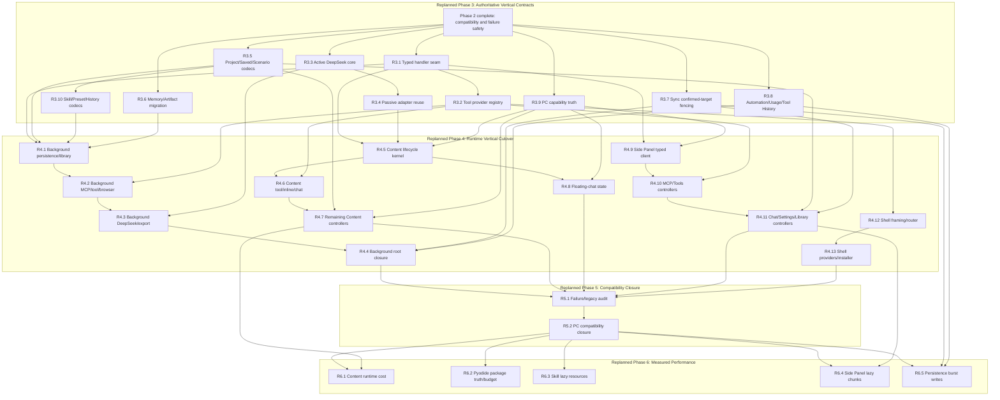
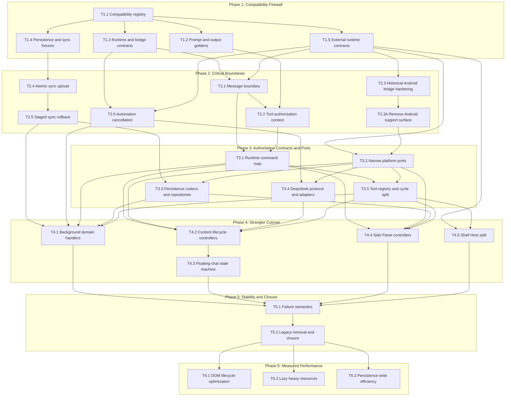

# DeepSeek++ Reliability and Compatibility Refactor — Dependency Graph

## Current Replanned Critical Path

Phase 2 telemetry triggered adaptive replanning. The current critical path is message/tool safety → typed handler seam → serial Background cutover, while DeepSeek, persistence, platform cleanup, Content, Side Panel, and Shell advance through separate owner lanes. Every task combines its boundary, real consumer, old-path deletion, and evidence.

## Superseded Pre-Replan Graph

The graph below is retained only to explain the old #322–#336 issue mapping. It is not executable after the Phase 2 adaptive replan.

## Current Integration Order

| Phase | Parallel Work | Required Serial Merge |
|:--|:--|:--|
| 1 | T1.2, T1.3, T1.4, and T1.5 after T1.1 | Merge contract indexes once after all fixture lanes finish. |
| 2 | Runtime/tool, platform-scope, sync, and automation lanes | T2.1 → T2.2; T2.3 → T2.3A; T2.4 → T2.5; merge runtime/tool before rebasing automation wiring. |
| 3 | Typed command/tool, DeepSeek, store, sync, and PC capability lanes | R3.1 precedes R3.2; R3.3 precedes R3.4; stores are isolated but shared fixtures require fresh rebases. |
| 4 | Background, Content, Side Panel, and Shell lanes | Each hotspot has exactly one serial owner lane; no two live branches edit the same root. |
| 5 | None | R5.1 audits bounded leftovers; R5.2 runs the full PC compatibility closure. |
| 6 | Content, package, Skill, Side Panel, and persistence lanes | Each task records its own pre-change baseline and reruns compatibility evidence after optimization. |

## Forbidden Dependency Shapes

- Contract or schema modules importing browser, DOM, provider, or entrypoint implementations.
- A new router running beside the existing background switch after a command has migrated.
- A persistence migration writing both legacy and current stores as peer truth sources.
- A broad platform/service abstraction with no production consumer in the same task.
- More than one concurrent executor editing `entrypoints/background.ts` or `entrypoints/content.ts`.
- A performance task claiming improvement without a fixed pre-change input, measurement unit, and reviewed threshold.
