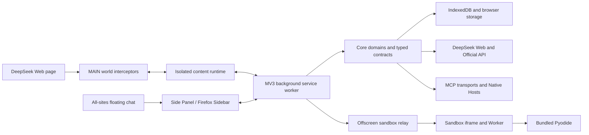

# DeepSeek++ PC Runtime Hardening Wave 2 — Project Overview

## Preliminary Direction

在上一轮可靠性与兼容性重构已经完成的基础上，继续处理 PC 端 Chrome、Edge、Firefox 扩展中仍有明确证据的运行时、兼容性与性能缺口。Android、移动 WebView、移动包和移动发布路径继续永久排除；本轮保持现有 prompt、工具 XML、存储、消息、MCP、Native Host 与用户可见合法行为不变，并采用多个验收 Issue 汇入一个批次分支和一张最终 PR。

## Confirmed Task Definition

用户已明确授权继续开发，并要求避免一 Issue 一 PR 的串行低效流程。Phase 1 后按这项授权和既定 PC-only 约束确认本轮为 **PC Runtime Hardening Wave 2**：

1. **Scope**：先关闭有现成 fixture、失败语义或预算证据的 MCP、platform capability、Shell contract、request/tool-stream 和 Side Panel first-chat 缺口；同时修正 live compatibility gap ownership。
2. **Deferred**：Content/Background 全面拆分、`core/types.ts` 全量迁移、Skill importer 大重写和完整浏览器 E2E 平台，不塞入第一批。
3. **Compatibility**：合法 prompt、tool XML、runtime/bridge/MCP/Native wire、storage/IndexedDB/sync 与 Chrome/Edge/Firefox 用户行为不变；只把 malformed/current-gap 路径改为显式、可测失败。
4. **Performance**：只优化有构建证据的 Side Panel first-chat 路径；先测量，再降低预算，不以移动上限代替优化。
5. **Testing**：每项行为变更补自动化测试；最终依次通过 targeted tests、compile、prompt freeze（受影响时）、三浏览器 build、manifest/UTF-8 与 `ci:quality`。
6. **Delivery**：使用多个 GitHub Issue 作为验收清单，全部汇入当前 `codex/pc-runtime-hardening-wave-2` 集成分支和一张最终 PR；每个 Issue 在合并前单独记录遥测。
7. **Governance**：`AGENTS.md` 是唯一 repo instruction truth；使用平台 native memory，不创建 repo-local memory；上一轮 archive 保持只读。

## Continuity Result

- 基线：`origin/main` / `450b5e2e8e2e61a73417c26840ef9d0224418eb6`。
- 上一轮记录：[`docs/archives/deepseek-pp-reliability-compatibility-refactor/progress/MASTER.md`](../archives/deepseek-pp-reliability-compatibility-refactor/progress/MASTER.md)；状态为 complete and archived，PR #394 已合并。
- GitHub 实时状态：没有未完成的 `spec-driven` Issue；因此本轮是新 run，不修改上一轮归档。
- 工作方式：原 `/Users/zcl/code/deepseek-pp` 工作树有用户未提交改动，本轮在 `/Users/zcl/code/deepseek-pp-worktrees/pc-runtime-hardening-wave-2` 隔离分支工作。
- Tracking pre-flight：`GITHUB_STANDARD`；Issues、Milestones、PR 可用，GitHub Project board 不可用/不使用。

## Current Architecture

上一轮已经建立一个 typed background registry、Content lifecycle/resource kernel、Side Panel typed client、Shell provider/router 分层、严格持久化恢复协议和包体/热路径预算。当前架构没有 TypeScript relative-import SCC，但仍有三类明显传播中心：`entrypoints/content.ts` 7,417 行、`entrypoints/background.ts` 1,411 行，以及 `core/types.ts` 的高 fan-in 类型桶。

## Technology Stack

| Layer | Current | Wave-2 position |
|:--|:--|:--|
| Language | TypeScript 5.9 / ESM | 保留 |
| Extension framework | WXT 0.20 / MV3 | 保留 |
| UI | React 19 / Tailwind CSS 4 | 保留，按证据做按需加载或 controller 收口 |
| Persistence | Dexie / IndexedDB / browser storage | 身份与 schema 保持不变 |
| Runtime integration | MAIN/content bridge、runtime messaging、MCP、Native Messaging | 接收边界必须严格、单一且可测试 |
| Sandbox | Offscreen、iframe、Worker、Pyodide | 保留 PC 浏览器降级语义 |
| Tests | Vitest 4 / jsdom / fake IndexedDB / smoke scripts | 增强窄真实浏览器证据，不建设无边界大型 E2E 平台 |
| Build and release | npm workspaces、WXT、GitHub Actions | 保留 Chrome/Edge/Firefox 构建和包验证 |

## Entry Points

| Entry point | Responsibility | Current signal |
|:--|:--|:--|
| `entrypoints/main-world.content.ts` | MAIN bridge、navigation 与 interceptor composition | 89 行；单侧重启/重新握手已经受测 |
| `entrypoints/content.ts` | DeepSeek DOM、工具、inline agent、主题、宠物、导出、多模态组合 | 7,417 行；资源生命周期已有 owner，但 feature state 仍集中 |
| `entrypoints/background.ts` | 唯一 runtime listener、handler composition、service-worker lifecycle | 1,411 行；command 已全 typed，仍有较高冷启动 fan-out |
| `entrypoints/sidepanel/` | React surfaces 与 typed controllers | 60 个 TS/TSX、13,390 行；首个 Chat screen 靠近现有预算上限 |
| `entrypoints/floating-chat.content.ts` | `<all_urls>` launcher composition | 禁用时仍有 content-script 启动成本 |
| `entrypoints/sandbox-offscreen/` / `sandbox-runner/` | Chromium offscreen relay 与执行 Worker | 多层边界仍需保持一致 |
| `packages/shell-host/native/` | Native framing、MCP router、providers | provider 已拆分；server version 与 catalog 仍存在真相源漂移 |

## Build and Run

| Purpose | Command |
|:--|:--|
| Prepare generated types | `npm run postinstall` |
| Targeted tests | `vitest run <files>`，使用 60 秒硬超时 |
| TypeScript | `npm run compile` |
| Prompt compatibility | `npm run prompt:freeze` |
| Browser builds | `npm run build:all` |
| Manifest and encoding | `npm run verify:manifest-policy`; `npm run verify:extension-utf8` |
| Full closure | `npm run ci:quality` |

## Testing Baseline

- 从已完成 owner-lane 复用依赖后先执行 `npm run postinstall` 生成 worktree-local `.wxt/tsconfig.json`。
- 当前 HEAD 的候选缺口测试基线通过：6 files / 47 tests（request augmentation、DeepSeek protocol、streaming tool parser/text、platform contract、Shell external contract）。
- `npm run compile` 通过。
- 上一轮完整 `ci:quality`：161 test files / 1,166 tests、三浏览器 build/zip/package、prompt freeze、MCP/Shell/PoW、manifest/UTF-8、离线 Pyodide 均通过。
- 仍缺少能够证明 unpacked extension 确实加载成功的真实 Chrome lifecycle smoke；上一轮 Chrome 150 命令行加载失败，因此没有把它记作通过。

## Pre-implementation Findings (closed by PR #402)

上一轮只读审计曾提出的五项问题已经在 `450b5e2` 修复，不得重复立项：MAIN/content 单侧重启、Settings `GET_CONFIG` 解码、Side Panel runtime failure 重复实现、PET load/event 竞态、auth refresh 广泛吞错。

以下条目是 PR #402 合并前有直接证据的候选缺口快照，均已在该 PR 与最终 `ci:quality` 中关闭；仅作为实施前证据保留，不是当前待办。当前状态以 [`docs/progress/MASTER.md`](../progress/MASTER.md) 为准。

1. MCP JSON-RPC response 接收仍会规范化错误版本/错误 ID/`result + error`；工具输出按 UTF-16 字符截断；分页可超过 `maxToolCount`。
2. Platform fixture 仍冻结三项已过期 gap：未声明 `downloads` 权限却探测能力、sync identity 没有 consumer-owned capability、环境未加载时 Shell 乐观判为支持。
3. 浏览器与 Native tool catalog 仍存在双写面；Shell Native router 的版本报告已收敛到 npm package metadata，不再固定为 `1.0.0`。
4. DeepSeek request augmentation 对合法 JSON 但非对象/非字符串 prompt 没有单一严格 decoder；解析和 authorization 前置顺序仍可收紧。
5. Streaming tool call 在 EOF 未闭合时清空 parser state，已发出的 `started` 事件没有显式终态。
6. Side Panel 首个 Chat screen 仅剩不足 1% 的 raw/gzip budget 余量。
7. Live compatibility fixtures 仍把若干 gap 指向已经关闭的旧 R4/R5 Issue，治理记录与实际状态不一致。

## Project Governance Baseline

| Surface | Resolution |
|:--|:--|
| Root `AGENTS.md` | 唯一项目级 instruction truth source |
| Root `CLAUDE.md` | 不存在，也不得创建 |
| Nested video instructions | 仅适用于 `videos/deepseek-pp-promo/`，本轮不触碰 |
| Native project memory | 可用于跨会话工作流上下文；不会把 repo-local Markdown 当 memory fallback |
| Repo-local memory | 明确禁止 |
| Active spec docs | 本轮新建 `docs/analysis/`；上一轮归档保持只读 |

## External Integrations

- DeepSeek Web/Official API：`core/deepseek/`、`core/interceptor/`
- MCP：`core/mcp/` 的 HTTP、SSE、Streamable HTTP、bridge、Native transports
- Shell Native Host：`packages/shell-host/`
- Sync：WebDAV、Google Drive、OneDrive，位于 `core/sync/`
- Browser Control：Chrome Debugger Protocol，位于 `core/browser-control/`
- Sandbox/Pyodide：`core/sandbox/` 与 sandbox entrypoints
