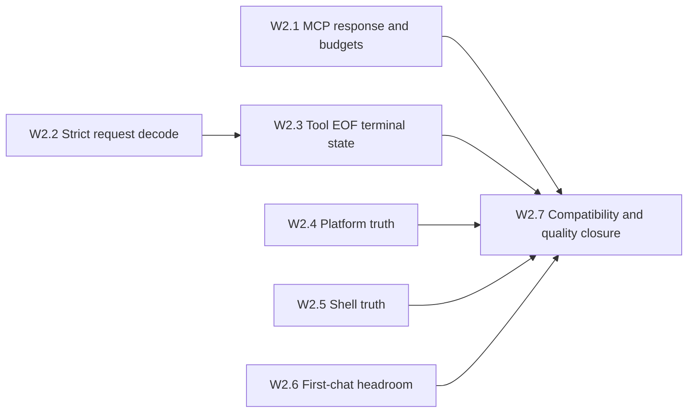

# DeepSeek++ PC Runtime Hardening Wave 2 — Dependency Graph

## Execution Graph

## Parallel Lanes

| Lane | Ordered work | Shared hot spots |
|:--|:--|:--|
| A | W2.1 | MCP transport/client and fixtures only |
| B | W2.2 → W2.3 | Interceptor parser/fetch paths; strictly serial |
| C | W2.4 | Platform plus narrow sync/Side Panel consumers |
| D | W2.5 | Shell browser/native/package contract |
| E | W2.6 | Chat rendering and executable bundle budget |
| F | W2.7 | Sole owner of live gaps, active progress and closure evidence |

## Integration Order

1. Land independent contract changes from A, C, D and E after task-local validation.
2. Land B1/W2.2 before B2/W2.3 so request and stream changes are reviewed against one interceptor baseline.
3. Resolve only real overlap; do not create compatibility adapters between owner lanes.
4. Run W2.7 after all code tasks are integrated and update live gap ownership from executable evidence.

## Critical Path

`W2.2 → W2.3 → W2.7` is the only mandatory serial code path. W2.7 is the final quality gate for every lane and the single batch PR.
