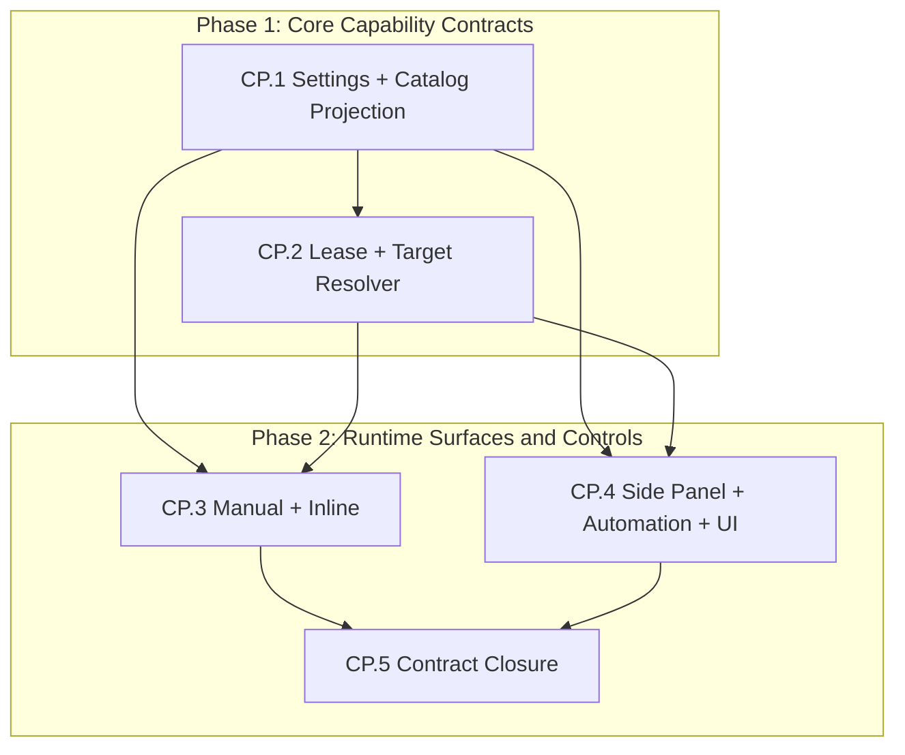

# MCP Capability Plane — Dependency Graph

```mermaid
flowchart TD
  subgraph P1["Phase 1: Core Capability Contracts"]
    CP1["CP.1 Settings + Catalog Projection"] --> CP2["CP.2 Lease + Target Resolver"]
  end
  subgraph P2["Phase 2: Runtime Surfaces and Controls"]
    CP3["CP.3 Manual + Inline"]
    CP4["CP.4 Side Panel + Automation + UI"]
    CP5["CP.5 Contract Closure"]
  end
  CP1 --> CP3
  CP2 --> CP3
  CP1 --> CP4
  CP2 --> CP4
  CP3 --> CP5
  CP4 --> CP5
```
